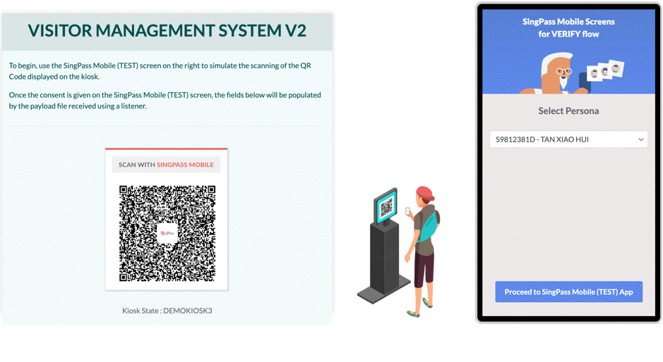

<p align="center">
<a href="https://ndi-api.gov.sg/library/sg-verify/introduction">
  
  </a>
</p>


# Verify Demo App

The demo application meant to illustrate how to integrate a Visitor Management System (VMS) with Verify APIs.

## Contents


- [Quick Start](#quick-start)
- [How To Use](#how-to-use)
- [URL & QR Code Generation](#qrcode)
- [Enable Payload Encryption & PKI Digital Signature](#pki)
- [MyInfo Connector NodeJS](#lib)
- [Change Logs](./CHANGELOG.md)

<br/><br/><br/>


## <a name="quick-start"></a>Quick Start

### 1.1 Install Node and NPM (_skip this step if you have NPM installed_)

For the demo application to run, you will need to install Node and NPM.

Follow the instructions given by the links below depending on your OS.

- [Install Node and NPM for Windows](http://blog.teamtreehouse.com/install-node-js-npm-windows)
- [Install Node and NPM for Linux](http://blog.teamtreehouse.com/install-node-js-npm-linux)
- [Install Node and NPM for Mac](http://blog.teamtreehouse.com/install-node-js-npm-mac)


### 1.2 Run NPM install

Run the following command in the folder you unzipped the application:

```
npm install
```

### 1.3 Start the Application

Execute the following command to start the application:
```
npm start
```


**Access the Application on Your Browser**
You should be able to access the sample application via the following URL:

```
http://localhost:3002
```




## <a name="how-to-use"></a>How To Use

The application describes a demo Visitor Management System (VMS),

- Files in ``your-vms-client`` and ``your-vms-server`` represent the VMS Client and Server respectively and can be modified.

- Files in  ``mock-server``  are for mocking SingPass Mobile and VERIFY Server flow and SHOULD NOT be modified. 


## <a name="qrcode"></a>URL & QR Code Generation

To enable Dynamic QR. Edit ``your-vms-server/app.js``
Look for ``let qrCodeParams``. To enable static QR, uncomment and use these configurations:

```
  let qrCodeParams = {
    'qrType': 'static' 
    ...
  }
```

To enable dynamic QR, uncomment and use these configurations:

```
  let qrCodeParams = {
    'qrType': 'dynamic',
    ...
  }
```


## <a name="pki"></a>Enable Payload Encryption & PKI Digital Signature

To enable payload encryption and signing. Edit ``your-vms-server/config/config.js``. Look for ``Without encryption and signing``, uncomment and use these configurations: 

```
/* Without Encryption and Signing 
  Note: The sandbox environment is used for your testing when developing your prototype
*/
'ENVIRONMENT' : 'SANDBOX',
'TOKEN_URL' : 'https://sandbox.api.myinfo.gov.sg/sgverify/v2/token',
'PERSON_URL' : 'https://sandbox.api.myinfo.gov.sg/sgverify/v2/person',

```

To disable payload encryption and signing. Look for ``With encryption and signing``, uncomment and use these configurations: 

```
/* With Encryption and Signing 
  Note: The test environment is used for testing your application with the full security measures required in production
*/
'ENVIRONMENT' : 'TEST',
'TOKEN_URL' : 'https://test.api.myinfo.gov.sg/sgverify/v2/token',
'PERSON_URL' : 'https://test.api.myinfo.gov.sg/sgverify/v2/person',
```


## <a name="lib"></a>MyInfo Connector NodeJS

This demo application is calling the [myinfo-connector-nodejs](https://github.com/singpass/myinfo-connector-nodejs) library. MyInfo Connector aims to simplify consumer's integration effort with MyInfo or Verify by providing an easy to use Javascript library to integrate into your application.


## Reporting Issue

You may contact our [support](mailto:support@myinfo.gov.sg?subject=[SGVerifyV2]%20Sample%20App) for any other technical issues, and we will respond to you within 5 working days.
